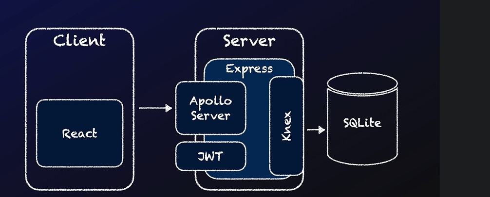
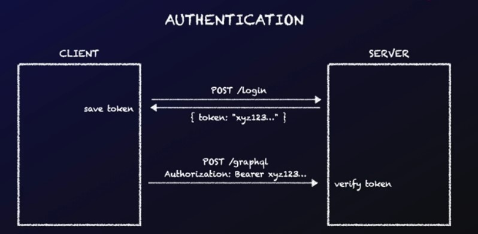

# JOB BOARD

## Architecture




## SQLite Database
- Install `SQLite Viewer` as an extension in you VSCode in order to view `db.sqlite3` file.
- For connection or linking to database we are using `knex.js` library. it is a sql query builder enables us to talk to the database.

## Authentication




context is a middleware that can be used for everything. `Context` has `req` and `res` express arguments. We can use that for authentication.

```javascript
app.use('/graphql', apolloMiddleware(apolloServer, { context: getContext }));
```

in the `express-jwt` The decoded JWT payload is available on the request via the `auth` property.